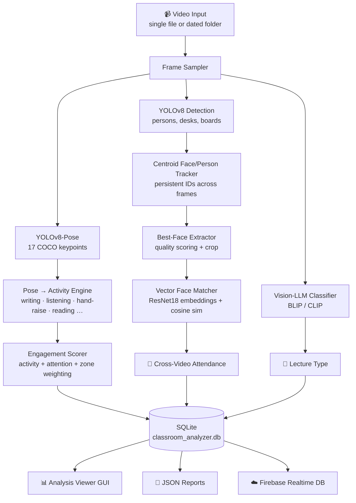

<div align="center">

# 🎓 Smart Classroom Analyzer

### AI-Powered Classroom Engagement, Attendance & Behavior Analytics from Video

*Turn any classroom recording into structured insight — who was present, how engaged they were, what kind of session it was — fully automated, on-device, no cloud inference required.*

<br>


</div>

---

## 📖 Overview

**Smart Classroom Analyzer** is an end-to-end computer-vision system that watches a recorded classroom session and automatically produces a rich analytics report — **without any manual tagging or attendance roll-call**.

Point it at a video (or a folder of videos organized by date) and it will:

- 🧍 **Detect and track every student** across frames using YOLOv8 + a custom centroid tracker
- 🤸 **Infer per-student activity and posture** (writing, listening, raising hand, reading, distracted…) from **COCO pose keypoints**
- 📊 **Compute an engagement score** for each student and for the class as a whole
- 🗺️ **Map the classroom into zones** (front / middle / back) and analyze engagement geographically
- 🧑‍🤝‍🧑 **Recognize the same student across multiple videos** using deep face embeddings — enabling **automatic multi-session attendance**
- 🎤 **Classify the type of session** (Lecture, Group Discussion, Hands-on, Presentation, Q&A, Reading) using a **vision-language model**
- 💾 **Persist everything** to a local SQLite database and optionally **sync to Firebase** in real time
- 🖥️ **Present it all** through a desktop GUI, an interactive analysis viewer, and exportable JSON reports

It is designed to run **entirely on-device** — all detection, pose estimation, face matching, and scene classification happen locally. It also ships with a **one-click packaged executable** build for non-technical users.

> 🏆 Built for **CodeOdyssey** — engineered as a complete product, not a proof-of-concept: batch automation, a persistence layer, cloud sync, a GUI, and a standalone build pipeline are all included.

---

## ✨ Key Features

| # | Feature | What it does | Powered by |
|---|---------|--------------|------------|
| 1 | **Real-Time Video Analysis** | Live, annotated playback with skeletons, activity labels, and a stats HUD | `YOLOv8` · `OpenCV` |
| 2 | **Pose-Based Activity Recognition** | Classifies each student's activity from 17 body keypoints | `YOLOv8-Pose` (COCO) |
| 3 | **Engagement Scoring** | Weighted per-student engagement from activity + attention + zone | Custom heuristic model |
| 4 | **Zone Analytics** | Splits the room into front/middle/back and compares engagement | Spatial partitioning |
| 5 | **Cross-Video Face Matching** | Recognizes the same person across different videos/days | `ResNet18` embeddings + cosine similarity |
| 6 | **Automatic Attendance** | Increments attendance when a known face reappears | Vector face database |
| 7 | **Lecture-Type Classification** | Labels the session type from sampled frames | `BLIP` / `CLIP` vision-language models |
| 8 | **Data Persistence** | Full analysis history, students, faces, sessions | `SQLite` |
| 9 | **Firebase Cloud Sync** | Pushes daily analytics + backups to the cloud | `Firebase Admin SDK` |
| 10 | **Batch Automation** | Auto-detects and processes all unprocessed videos by date | `automated_video_processor` |
| 11 | **Desktop GUI + Viewer** | Point-and-click operation with a tabbed results explorer | `Tkinter` |
| 12 | **Standalone Executable** | Ships as a single `.exe` — no Python needed by end users | `PyInstaller` |

---

## 🏗️ System Architecture



### Analysis Pipeline in Depth

1. **Ingestion** — A single video, or an entire `video_processing/<YYYY-MM-DD>/` folder, is fed in. The batch processor tracks which files were already analyzed so runs are idempotent.
2. **Detection** — `yolov8s.pt` locates people (and classroom objects like desks/whiteboards); `yolov8n-pose.pt` extracts 17 COCO body keypoints per person.
3. **Tracking** — A lightweight **centroid-distance tracker** assigns a stable ID to each person, tolerating brief disappearances (configurable `max_disappeared` / `max_distance`).
4. **Activity Inference** — Geometric relationships between wrists, shoulders, elbows, eyes, and nose are used to infer activity (e.g. *hand raised* when a wrist rises above its shoulder) with a **confidence score**, mapped to the `classroom_labels.json` schema.
5. **Engagement Scoring** — Each student receives a weighted engagement score combining their activity type, attention level, spatial zone, and detection confidence, then bucketed into engaged / partially engaged / disengaged.
6. **Face Capture & Matching** — The highest-quality face crop per tracked ID is embedded with **ResNet18** and compared (cosine similarity, threshold ≈ 0.7) against a persistent **vector face database** to link identities across videos and days.
7. **Scene Classification** — Representative frames are captioned/scored by a **BLIP/CLIP vision-language model** (with a rule-based fallback) to label the session type.
8. **Persistence & Sync** — Everything lands in **SQLite**; a Firebase module can mirror daily aggregates and JSON backups to the **Realtime Database**.

---

## 🧠 The Models & Methods

<table>
<tr><th>Stage</th><th>Technique</th><th>Details</th></tr>
<tr>
<td><b>Object Detection</b></td>
<td>YOLOv8s</td>
<td>Detects students and classroom objects (desk, chair, whiteboard, door) per the label schema.</td>
</tr>
<tr>
<td><b>Pose Estimation</b></td>
<td>YOLOv8n-Pose</td>
<td>17-point COCO skeleton; keypoint geometry drives activity/posture inference.</td>
</tr>
<tr>
<td><b>Activity Recognition</b></td>
<td>Rule-based pose kinematics</td>
<td>11 activity classes (writing, listening, talking, using_phone, sleeping, raising_hand, walking, distracted, reading, eating, unknown) with confidence weighting.</td>
</tr>
<tr>
<td><b>Face Re-Identification</b></td>
<td>ResNet18 embeddings + cosine similarity</td>
<td>Penultimate-layer feature vectors compared against a pickled vector DB for cross-video identity linking. (Alternate <code>face_recognition</code>-based matchers also included.)</td>
</tr>
<tr>
<td><b>Scene / Lecture Classification</b></td>
<td>BLIP + CLIP (with rule fallback)</td>
<td>Vision-language captioning/scoring of sampled frames into 6 session types.</td>
</tr>
<tr>
<td><b>Engagement Model</b></td>
<td>Weighted heuristic</td>
<td>Fuses activity, attention level, classroom zone, and confidence into a normalized engagement score.</td>
</tr>
</table>

### 🎯 Activity & Attribute Schema

| Attribute | Possible Values |
|-----------|----------------|
| **Activity** | `writing` · `listening` · `talking` · `using_phone` · `sleeping` · `raising_hand` · `walking` · `distracted` · `reading` · `eating` · `unknown` |
| **Posture** | `sitting` · `standing` · `leaning` · `slouching` |
| **Attention** | `focused` · `partially_focused` · `distracted` · `not_visible` |
| **Zone** | `front` (top 40%) · `middle` · `back` |

---

## 📂 Project Structure

```
CodeOdessyFinal/
│
├── 🎯 Core Analysis Engine
│   ├── realtime_classroom_analyzer.py     # Main engine: detection, tracking, pose, engagement, HUD
│   ├── face_track_engagement_analyzer.py  # Face-track + engagement reporting variant
│   └── classroom_labels.json              # Annotation schema (activities, postures, objects)
│
├── 🧑‍🤝‍🧑 Face Recognition & Attendance
│   ├── vector_face_matcher.py             # ResNet18 embedding matcher (primary)
│   ├── enhanced_face_matcher.py           # face_recognition-based matcher
│   ├── video_face_matcher.py              # Cross-video attendance matching
│   └── vector_face_database.pkl           # Persistent face embedding store
│
├── 🎤 Lecture Classification
│   ├── vision_llm_classifier.py           # BLIP/CLIP vision-language classifier
│   ├── lecture_classifier.py              # Orchestration + rule-based fallback
│   └── lightweight_vision_classifier.py   # Low-resource classifier
│
├── 💾 Data Layer
│   ├── data_manager.py                    # SQLite schema + CRUD + backup/restore
│   ├── firebase_sync.py                   # Firebase Realtime DB sync + backups
│   └── classroom_analyzer.db              # SQLite database
│
├── 🖥️ User Interface
│   ├── classroom_analyzer_gui.py          # Main Tkinter desktop app
│   └── analysis_viewer.py                 # Tabbed results explorer (students, faces, timeline, stats)
│
├── 🤖 Automation
│   ├── automated_video_processor.py       # Batch-process videos by date, idempotent
│   └── setup_automated_processing.py      # Folder-structure bootstrapper
│
├── 📦 Build & Packaging
│   ├── build_executable.py / build_exe.py # PyInstaller build scripts
│   ├── ClassroomAnalyzer.spec             # PyInstaller spec
│   └── build*.bat                         # Windows build helpers
│
├── 🧪 Tests
│   └── test_*.py                          # Component, GUI, face-matching, Firebase tests
│
└── 📋 requirements*.txt                    # Layered dependency sets (core / advanced / firebase / build)
```

---

## 🚀 Getting Started

### Prerequisites

- **Python 3.9+**
- A machine with a few GB of RAM (GPU optional — CUDA accelerates but is not required)

### Installation

```bash
# 1. Clone the repository
git clone https://github.com/Divyansh-Singh05/smart-classroom-analyzer.git
cd smart-classroom-analyzer

# 2. Create & activate a virtual environment
python -m venv venv
source venv/bin/activate        # macOS / Linux
# venv\Scripts\activate         # Windows

# 3. Install dependencies
pip install -r requirements.txt          # core
pip install -r requirements_advanced.txt # + face recognition & vision LLM (optional but recommended)
pip install -r requirements_firebase.txt # + cloud sync (optional)
```

> 💡 **PyTorch tip:** install the build matching your hardware first —
> CPU: `pip install torch torchvision --index-url https://download.pytorch.org/whl/cpu`
> CUDA: `pip install torch torchvision --index-url https://download.pytorch.org/whl/cu118`

### Model Weights

YOLOv8 weights (`yolov8s.pt`, `yolov8n-pose.pt`) are downloaded automatically by Ultralytics on first run, or can be placed in the configured weights directory. Vision-language weights (BLIP/CLIP) are pulled from Hugging Face on first classification.

---

## 🎮 Usage

### Option 1 — Desktop GUI (recommended)

```bash
python classroom_analyzer_gui.py
```

1. **Browse** and select a classroom video
2. Click **▶️ Start Analysis** and watch the live annotated feed
3. Use the **Advanced Features** buttons once analysis completes:
   - 📊 **View Analysis** — tabbed explorer (Overview · Students · Face Gallery · Statistics · Timeline)
   - 👥 **Match Faces** — cross-video identity linking & attendance counts
   - 🎤 **Classify Lecture** — session-type prediction with confidence
   - 📋 **Attendance Report** — consolidated multi-session attendance

### Option 2 — Automated Batch Processing

Drop videos into date folders and let the system process everything unprocessed:

```
video_processing/
└── 2025-09-28/
    ├── period_1.mp4
    └── period_2.mp4
```

```bash
python automated_video_processor.py
```

### Option 3 — Direct Engine (headless / scriptable)

```python
from realtime_classroom_analyzer import RealTimeClassroomAnalyzer

analyzer = RealTimeClassroomAnalyzer(
    video_path="classroom.mp4",
    output_dir="realtime_analysis",
    headless_mode=True,   # no display window
    fast_mode=True,       # sample frames for speed
)
analyzer.analyze_video_realtime(display=False, save_frames=True)
```

### Option 4 — Standalone Executable

Build a distributable app (no Python required on the target machine):

```bash
python build_executable.py           # cross-platform helper
# or on Windows:
build_fixed.bat
```

The packaged `ClassroomAnalyzer` executable lands in `dist/`.

---

## 📊 Outputs

| Output | Location | Contents |
|--------|----------|----------|
| **Live visualization** | on-screen | Skeletons, activity labels, engagement colors, zone lines, stats HUD |
| **Best face crops** | `realtime_analysis/` | Quality-scored face images per tracked student |
| **Attendance reports** | `attendance_report_*.json` | Per-person appearance counts across videos |
| **Analysis history** | `analysis_history/` | Per-session structured results |
| **SQLite database** | `classroom_analyzer.db` | Videos, sessions, students, faces, attendance, classifications |
| **Cloud mirror** | Firebase Realtime DB | Daily aggregates + JSON backups |

---

## 🗄️ Data Model

The SQLite persistence layer (`data_manager.py`) is organized into seven related tables:

```
videos ─┬─ analysis_sessions ─┬─ students
        │                     ├─ faces
        │                     ├─ attendance_records
        │                     └─ face_matching_records
        └─ lecture_classifications
```

- **videos** — registered source files with content hashes (dedup)
- **analysis_sessions** — one row per analysis run, with metadata & status
- **students / faces** — detected identities and their best face imagery
- **attendance_records** — cross-session presence counts
- **lecture_classifications** — predicted session type + confidence + reasoning
- **face_matching_records** — identity links established between sessions

Built-in **backup / restore** and **retention cleanup** utilities are included.

---

## ☁️ Firebase Integration (Optional)

`firebase_sync.py` mirrors analytics to a **Firebase Realtime Database** under a clean `classroom_analyzer/daily_data/<date>` structure, including engagement, attendance, face data, lecture classifications, video metadata, and per-day statistics — plus local JSON backups.

To enable it:

1. Create a Firebase project and enable the **Realtime Database**.
2. Open `firebase_sync.py` and replace the placeholder values in `FIREBASE_CONFIG` (`YOUR_FIREBASE_API_KEY`, `YOUR_PROJECT_ID`, etc.) with your project's web config from **Firebase Console → Project Settings → General → Your apps**.
3. Download a service-account key (**Project Settings → Service Accounts**) and save it locally as `firebase_service_account.json`.

> 🔒 **Security note:** `firebase_service_account.json` is a real credential and is already excluded via `.gitignore` — never commit it. Likewise, never commit `FIREBASE_CONFIG` with real values filled in; keep the placeholders in version control and fill them in locally only.

---

## 🧪 Testing

A broad suite of component and integration tests ships with the project:

```bash
python test_complete_system.py       # end-to-end system check
python test_components.py            # individual module checks
python test_enhanced_face_matching.py
python test_firebase_sync.py
python test_gui_buttons.py
```

---

## 🛠️ Tech Stack

<div align="center">

| Domain | Technologies |
|--------|-------------|
| **Computer Vision** | OpenCV · Ultralytics YOLOv8 (detection + pose) |
| **Deep Learning** | PyTorch · TorchVision · ResNet18 · Transformers (BLIP / CLIP) |
| **Face Recognition** | Vector embeddings · cosine similarity · `face_recognition` |
| **Data & Persistence** | SQLite · Firebase Realtime Database · NumPy · pandas |
| **Interface** | Tkinter · Matplotlib · Seaborn |
| **Packaging** | PyInstaller |

</div>

---

## 🗺️ Roadmap

- [ ] Fine-tuned pose→activity classifier to replace heuristic rules
- [ ] Web dashboard (React) reading directly from Firebase
- [ ] Real-time streaming (live camera) mode
- [ ] Multi-camera fusion for large lecture halls
- [ ] Privacy mode: on-device face hashing without storing crops

---

## 🤝 Contributing

Contributions are welcome. Please open an issue to discuss substantial changes, keep pull requests focused, and add/adjust tests where relevant.

---

## 📜 License

**© 2025 Divyansh Singh. All rights reserved.**

No open-source license is currently granted. The code is publicly viewable for portfolio and evaluation purposes; please contact the author before reusing, redistributing, or building upon it.

---

## 🙏 Acknowledgements

- [Ultralytics YOLOv8](https://github.com/ultralytics/ultralytics) for detection & pose
- [Salesforce BLIP](https://github.com/salesforce/BLIP) & [OpenAI CLIP](https://github.com/openai/CLIP) for scene understanding
- [PyTorch](https://pytorch.org/) & [OpenCV](https://opencv.org/) for the vision foundation

<div align="center">

<br>

**Built with ❤️ for smarter, effortless classrooms**

⭐ *If this project impressed you, consider starring the repo!* ⭐

</div>
